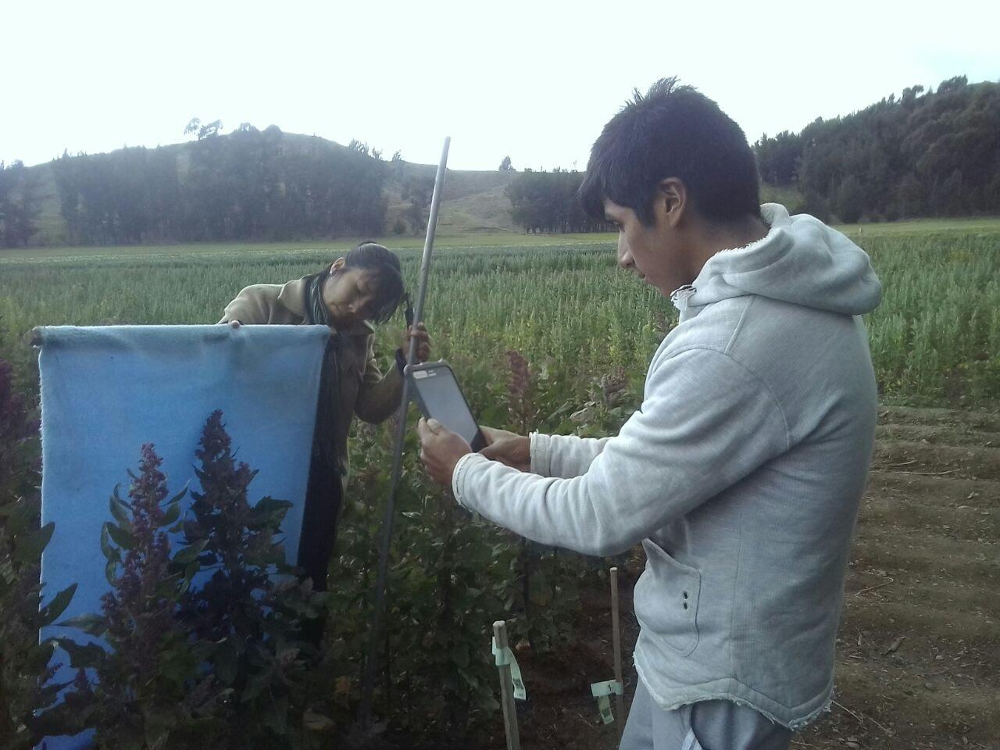
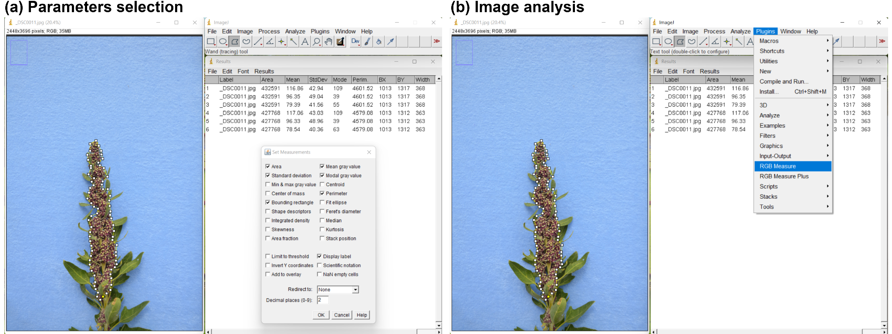

**A high-throughput phenotyping pipeline for quinoa (*Chenopodium quinoa*) panicles using image analysis with convolutional neural networks**

Flavio Lozano-Isla^1,2^, Lydia Kienbaum^1^, Bettina I.G. Haussmann^1,3^, Karl Schmid^1\*^

^1^ Institute of Plant Breeding, Seed Science and Population Genetics, University of Hohenheim, Stuttgart, Germany

^2^ Present affiliation: Instituto de Investigación para el Desarrollo Sustentable de Ceja de Selva (INDES-CES), Universidad Nacional Toribio Rodríguez de Mendoza de Amazonas, Chachapoyas, Peru.

^3^ Present affiliation: German Institute for Tropical and Subtropical Agriculture (DITSL GmbH), Witzenhausen, Germany

\*Corresponding author. Email: [karl.schmid@uni-hohenheim.de](mailto:karl.schmid@uni-hohenheim.de)

**ORCID IDs:**

Flavio Lozano-Isla: 0000-0002-0714-669X

Lydia Kienbaum: 0000-0003-0218-693X

Bettina I.G. Haussmann: 0000-0002-2360-6799 

Karl Schmid: 0000-0001-5129-895X 


**STATEMENTS AND DECLARATIONS**

**Acknowledgments**

We acknowledge support from the High Performance and Cloud Computing Group at the Zentrum für Datenverarbeitung of the University of Tübingen, the state of Baden-Württemberg through bwHPC, and the German Research Foundation (DFG) through grant no INST 37/935-1 FUGG. We thank Emilia Koch for the image annotation. Thanks to Paul, Jakob, Jose David,  Miguel, Edwin, and Blander who helped take the images in the field trials. Many thanks to Felix Bartusch from the University of Tübingen for his support in utilizing the BinAC high-performance computing infrastructure.

## Data availability statement

The code used for analysis and images for annotation is available at the GitHub repository: [https://github.com/Flavjack/quinoa\_panicle\_phenotyping](https://github.com/Flavjack/quinoa_panicle_phenotyping) 

**Funding statement**

This work was funded by a capacity development program of KWS SAAT SE & CO KGaA grant to the Universidad Nacional del Altiplano Puno and the University of Hohenheim.

**Conflict of interest statement**

The authors declare that the research was conducted without any commercial or financial relationships that could be potential conflicts of interest.

**Author contributions**

Conception and design of the study by FLI, LK, BIGH, and KS. FLI and LK performed the material preparation, data collection, and analysis. FLI and LK wrote the first draft of the manuscript. All the authors commented on previous versions of the manuscript. All the authors read and approved the final manuscript.


# 

# ABSTRACT

Quinoa is a grain crop with excellent nutritional properties that has attracted global attention for its potential contribution to future food security in a changing climate. Despite its long history of cultivation, quinoa has been improved slightly by modern breeding and is a niche crop outside its native cultivation area. Grain yield is strongly affected by panicle traits, whose phenotypic analysis is time-consuming and prone to error because of their complex architecture, and automated image analysis is an efficient alternative. We designed a panicle phenotyping pipeline implemented in Python via mask R-convolutional neural networks for panicle segmentation and classification. After model training, we analyzed 5,151 images of quinoa panicles collected over three consecutive seasons from a breeding program in the Peruvian highlands. The pipeline follows a stagewise approach, which first selects the optimal segmentation model and then another model that best classifies panicle shape. The best segmentation model achieved a mean average precision (mAP) score of 83.16 and successfully extracted the panicle length, width, area, and RGB values. The classification model achieved 95% prediction accuracy for the amarantiform and glomerulate panicle types. A comparison with manual trait measurements via ImageJ revealed a high correlation for panicle traits (r>0.94, p<0.001). We used the pipeline with images from multilocation trials to estimate genetic variance components of an index on the basis of panicle length and width. We further updated the model for images that included metric scales taken in field trials to extract metric measurements of panicle traits. Our pipeline enables accurate and cost-effective phenotyping of quinoa panicles. Using automated phenotyping based on deep learning, optimal panicle ideotypes can be selected in quinoa breeding and improve the competitiveness of this underutilized crop.

**Keywords:** deep learning, genetic resources, GenBank phenomics, ImageJ, plant breeding, image analysis

# 

# INTRODUCTION

Phenotyping is a key process in plant breeding programs aimed at developing new varieties of crops with relatively high yields. However, phenotyping poses a bottleneck in the breeding process because of the labor-intensive nature of the process and high cost. Manual phenotyping may result in reduced accuracy and prolonged timelines in breeding programs. Recent advances in phenotyping technologies, such as the use of neural networks for image analysis, have revolutionized plant phenotyping by increasing precision, reducing labor intensity, and enabling the identification of new traits relevant to crop breeding [(Araus et al., 2018; Warman & Fowler, 2021)](https://www.zotero.org/google-docs/?6YYpPH). This development of technology benefits not only major crops but also minor and orphan crops because the limited resources available for the improvement of such crops can be compensated for by low-cost technological approaches for genetic and phenotypic analyses.

Quinoa (*Chenopodium quinoa* Willd.) is an example of an orphan crop. It originates from the Andean region, where it has played a vital role as a staple food for small-scale farmers in the Andean highlands [(Hellin & Higman, 2005; Jacobsen, 2003)](https://www.zotero.org/google-docs/?OM9Btv). For thousands of years, farmers have contributed to the domestication and selection of quinoa varieties, resulting in high genetic and phenotypic diversity [(Bazile, Jacobsen, et al., 2016a; Patiranage et al., 2022)](https://www.zotero.org/google-docs/?2GmyCZ). The grains of quinoa are highly valued for their nutritional properties and serve as a rich source of macronutrients and energy [(Bhargava et al., 2006; Chandra et al., 2018; Nowak et al., 2016; Repo-Carrasco et al., 2003)](https://www.zotero.org/google-docs/?sRZqJW). Furthermore, quinoa is remarkably resilient to abiotic stressors such as drought and salinity (reviewed by [Grenfell-Shaw & Tester, (2021)](https://www.zotero.org/google-docs/?9lTg5x)). Owing to these benefits, quinoa cultivation has started to spread beyond its native area. Nevertheless, despite the increasing number of countries growing quinoa, production volumes are small compared with those in the Andean region [(Bazile, Jacobsen, et al., 2016b; Zurita-Silva et al., 2014)](https://www.zotero.org/google-docs/?lZ0QO7). Although several breeding programs have been established [(Böndel & Schmid, 2021)](https://www.zotero.org/google-docs/?cxHhxq), modern quinoa varieties are still slightly improved compared with ancient landraces. The extensive phenotypic diversity of quinoa in its center of origin reveals a substantial degree of genetic diversity, which likely results from local adaptation and farmer selection [(Bazile et al. 2016](https://www.zotero.org/google-docs/?MBpVOB), [Jarvis et al. 2017)](https://www.zotero.org/google-docs/?tezQZF). This diversity manifests itself in various forms of morphological and physiological variation, including panicle shape, seed color, leaf color [(Bioversity International et al., 2013)](https://www.zotero.org/google-docs/?Zcu0r4), and varying degrees of tolerance to both biotic and abiotic stress factors. Recent efforts have aimed to standardize quinoa evaluation and characterize its diverse of traits for more effective application in breeding programs [(Stanschewski et al., 2021)](https://www.zotero.org/google-docs/?A6PR2F). However, the prevailing evaluation methods still largely rely on labor-intensive and frequently imprecise manual phenotyping via visual scales and cards.

The inflorescence of quinoa is a panicle, on which individual flowers are arranged in groups on secondary axes [(Wrigley et al., 2015)](https://www.zotero.org/google-docs/?0lFEyZ). The dimensions of the panicles, both width and length influence grain yield, making them target traits for selection in breeding programs [(Benlhabib et al., 2016a; Maliro et al., 2017; Santis et al., 2018)](https://www.zotero.org/google-docs/?NpuggU). We previously reported that the product of panicle length and panicle width was strongly correlated with yield and presented high heritability (H^2^=0.81; [(Lozano-Isla et al., 2023)](https://www.zotero.org/google-docs/?zuCxit)). Two types of inflorescence are distinguished [(Tapia et al., 1979)](https://www.zotero.org/google-docs/?axuvj9). The 'glomerulate' panicles develop compact primary axillary internodes and elongated internodes of flower clusters, which results in spherical inflorescences. The 'amarantiform' type develops elongated inflorescences similar to those of amaranth species, and the finger-shaped partial inflorescences originate directly from the main axis. Glomerulate inflorescences are considered to be wild type and are dominant over amarantiform inflorescences [(Gandarillas ](https://www.zotero.org/google-docs/?x1nZUx)1974), but the genetic basis of this variation is currently unknown. In the description of quinoa traits a third type of panicle shape was defined as 'intermediate' [(Bioversity International et al., 2013)](https://www.zotero.org/google-docs/?3eLMNs). Since grain yield is influenced by the size and type of quinoa panicle [(Craine et al., 2023)](https://www.zotero.org/google-docs/?ileCWn), efficient phenotyping of these panicle traits is expected to improve the selection of superior genotypes and enhance genetic gain.

Computational image analysis is revolutionizing plant phenotyping because of its precision and throughput. In particular, neural networks have emerged as potent tools for phenotyping and characterizing crop diversity [(Arya et al., 2022)](https://www.zotero.org/google-docs/?9DCtZE) because they frequently outperform traditional image analysis techniques [(Arya et al., 2022; Kang et al., 2023; Liu & Wang, 2020; Sabouri et al., 2021; Xie et al., 2020; D. Yu et al., 2023)](https://www.zotero.org/google-docs/?JVmMFB). The main objectives of image analysis are classification and image segmentation, which enable the measurement of traits such as size and shape. Additionally, it allows for the counting of features such as fruits or color extraction [(Ganesh et al., 2019; Jia et al., 2020; Lee & Shin, 2020; Zhou et al., 2019)](https://www.zotero.org/google-docs/?TI8jco). Among the available algorithms for neural network-based image analysis, Mask R-Convolutional Neural Networks (Mask R-CNN; [He et al. 2018)](https://www.zotero.org/google-docs/?vc67hD), have been particularly successful, because they allow accurate pixelwise mask prediction for objects. Mask R-CNN has found widespread applications in robotics [(Jia et al., 2020)](https://www.zotero.org/google-docs/?FHEn3C), medicine [(Anantharaman et al., 2018; Chiao et al., 2019)](https://www.zotero.org/google-docs/?8JFfm8), autonomous driving [(Fujiyoshi et al., 2019)](https://www.zotero.org/google-docs/?TC5x04), and plant science [(Ganesh et al., 2019; Jia et al., 2020; Kienbaum et al., 2021; Machefer et al., 2020)](https://www.zotero.org/google-docs/?vqG0qm). Among the classification models that identify and categorize objects within images, neural network architectures such as VGG16 [(Simonyan & Zisserman, 2015)](https://www.zotero.org/google-docs/?ceeNQd), InceptionV3 [(Szegedy et al., 2016)](https://www.zotero.org/google-docs/?nWPvDu), and EfficientNetB0 [(Tan & Le, 2020)](https://www.zotero.org/google-docs/?bXptwi) achieve state-of-the-art performance on multiple image classification tasks.

Considering the labor-intensive nature of quinoa panicle phenotyping under field conditions, we created a high-throughput pipeline for extracting phenotypic traits from images of quinoa panicles. This pipeline is based on our previous work ([Kienbaum et al. 2021)](https://www.zotero.org/google-docs/?PGzM9N), which employed Mask R-CNN for the classification and segmentation of maize cob images. In the present study, we adapted and optimized this approach for image classification, specifically for differentiating between glomerulate and amarantiform panicle types. We performed image segmentation to extract trait measurements to estimate quantitative-genetic parameters for yield components related to panicles. Our objective was to create a pipeline that achieves the same or higher level of accuracy as manual phenotyping but with significantly improved throughput, demonstrating the effectiveness of state-of-the-art image analysis via Mask R-CNN in characterizing complex panicle traits. First, we describe the development of a deep learning model specifically designed for the classification and segmentation of quinoa panicles using Mask R-CNN. We subsequently demonstrate the application of this pipeline in estimating quantitative genetic parameters from a multilocation trial.

# MATERIALS AND METHODS

## Plant material

The plant material used for the experiments was derived from six segregating populations of quinoa (*Chenopodium quinoa* Willd.) originating from single crosses of landraces provided by the germplasm bank of the Universidad Nacional del Altiplano, Puno, Peru [(Lozano-Isla et al., 2023)](https://www.zotero.org/google-docs/?Tumusi). The field trials were conducted in three successive growing seasons from 2016–2019 as multilocation trials for line selection ("selection trials"), and variety registration (“registration trials”) trials in the Peruvian Highlands ([Table  @tbl:id.r5y16fnovap5]:). Images from the 2021-2022 season for production and seed increase (“production trials”) were used for the validation set via scales in the images.

```Unknown element type at this position: UNSUPPORTED```


| **Trial**        | **Season**       | **Genotypes**    | **Generation**   | **Location**     | **Exp. design**  | **Device**       | **Resolution**   | **Pictures**     | **Scale**         |
|------------------|------------------|------------------|------------------|------------------|------------------|------------------|------------------|------------------|-------------------|
| Selection        | 2016-2017        | 1200             | F6               | Camacani, Puno   | RCBD             | Nikon D5101      | 2736 x 3648      | 3862             | no                |
| Registration     | 2017-2018        | 600              | F7               | Illpa, Puno      | Lattice 10x10    | ZTE Blade A610   | 2448 x 3264      | 1240             | no                |
| Registration     | 2018-2019        | 25               | F8               | Camacani, Puno   | Lattice 5x5      | Samsung SM-T285M | 1440 x 2560      | 25               | no                |
| Registration     | 2018-2019        | 25               | F8               | Illpa, Puno      | Lattice 5x5      | Samsung SM-T285M | 1440 x 2560      | 25               | no                |
| Production       | 2021-2022        | 57               | F10              | Camacani, Puno   | RCBD             | Motorola G30     | 3456 x 4608      | 108              | yes               |


: Images from multienvironmental trials from 2016 to 2019 employed for image analysis using high-throughput phenotyping for quinoa panicles. Experiments were conducted under different experimental designs (i.e. lattice and randomized complete blocks - RCBD) with presence of unbalanced data. Devices and image resolution were different for each experiment. The images from seasons 2021-2022 were used for model validation with the use of a scale in the images. {#tbl:id.r5y16fnovap5}


```Unknown element type at this position: UNSUPPORTED```## Panicle images 

Pictures were taken during flowering at stage 69 of the BBCH scale [(Sosa-Zuniga et al., 2017)](https://www.zotero.org/google-docs/?RVTuqo). A representative panicle for each experimental unit (breeding lines grown in experimental plots) was selected for photographing under field conditions in front of a blue background with different light conditions ([Figure  @fig:id.6ns3q793e24l]:, Figure S1). Images were taken with different cameras and resolutions ([Table  @tbl:id.r5y16fnovap5]:), resulting in an image collection exhibiting a high heterogeneity ([Figure  @fig:id.6ns3q793e24l]:a). We excluded images with panicles that showed bird damage, were blurred, or were overly dry from the analysis ([Figure  @fig:id.6ns3q793e24l]:b).  

{#fig:id.6ns3q793e24l}


## Development of a Mask R-CNN model for image segmentation

We found that it was challenging to obtain a single Mask R-CNN model suitable for both panicle segmentation and classification. Mask R-CNN is simple to train and extends Faster R-CNN by adding a branch for predicting an object mask in parallel with the existing branch for bounding box recognition [(Bharati & Pramanik, 2020)](https://www.zotero.org/google-docs/?v9oOZn). Consequently, we adopted a stagewise approach, selecting separate models for each task. A pipeline was implemented, connecting the best models of each stage. First, we developed models for image segmentation by testing 16 models and selecting the best model [(He et al., 2018)](https://www.zotero.org/google-docs/?0HP0i7) via the following procedure. 

### *Sampling and annotation* 

To ensure the selection of an unbiased training dataset, we created two random samples. The first sample involved selecting 25% from each experiment conducted in different years and locations ([Table  @tbl:id.r5y16fnovap5]:), resulting in a total of ca. 1,300 images. A random sample of 320 images was taken from this initial pool of images. The sample were divided into training and validation sets with 238 and 82 images respectively. The number of training images was determined on the nasis of a previous study of maize cob segmentation ([Kienbaum et al. 2021)](https://www.zotero.org/google-docs/?7qUKEG). The images were annotated via VGG Image Annotator version 2.0.8 [(Dutta & Zisserman, 2019)](https://www.zotero.org/google-docs/?FNaCkN). For selection and registration field trials, only the panicle class was annotated ([Table  @tbl:id.r5y16fnovap5]:). For the production field trial, seven classes were determined for the images: panicle, scale, label, barcode, and each channel from the RGB spectra (Figure S2).

### Model training

We utilized the Mask R-CNN framework [(He et al., 2018)](https://www.zotero.org/google-docs/?f4VkHW) and fitted it with the ResNet 101 backend to the seven classes. Model training was conducted on four parallel Tesla K80 GPUs on the BinAC high-performance computing cluster at the University of Tübingen. The Mask R-CNN training parameters were partly selected on the basis of previous work in image analysis for maize cobs [(Kienbaum et al., 2021)](https://www.zotero.org/google-docs/?M5ZDsr), with further variations and improvements implemented as needed. Compared with maize cobs, quinoa panicles exhibit greater detail and diversity in their outline and shape. Therefore, we varied parameters such as mask resolution, loss weight, and training configuration (heads.m) to investigate potential differences in the final model performance. This led to the training of 16 distinct Mask R-CNN models with a learning rate of 1e-4 over 200 epochs, each with different parameters * (*[Table  @tbl:id.vur4v4bpxbe8]: *).*

In Mask R-CNN, the mask resolution determines the size of the predicted masks for each object instance. A higher resolution yields a more detailed delineation of object boundaries but increases the computational time. We adjusted this parameter from the standard resolution of 28x28 pixels to an enhanced resolution of 56x56. This change required a minor modification in the Mask R-CNN architecture, which involved adding an extra convolutional layer at the end of the mask branch. The aim was to achieve a more precise panicle mask. 

Model optimization was based on the loss weight parameter. It ranged from the standard loss weight of 1 for each mask and class (mask01-class01) to an emphasis on mask optimization with a mask loss weight of 10 and a class loss weight of 1 (mask10–class01). We also experiment with classification optimization, adjusting the class loss weight to 10 and the mask loss weight to 1 (mask01-class10). The parameter heads.m indicates the training configuration, which either involves training all the layers of the ResNet-101 architecture or fine-tuning only the head layers while freezing all the other layers **([Table  @tbl:id.vur4v4bpxbe8]:)*.*

The performance of the segmentation model in detecting panicles was assessed via the intersection over union (IoU) score, also known as the Jaccard index [(Jaccard, 1901)](https://www.zotero.org/google-docs/?ZU4rg8). This metric is widely used in evaluating the performance of object detection. The effectiveness of our trained models was measured via the mean average precision (mAP) over different IoU thresholds ranging from 50–95% in 5% increments (AP@[IoU = 0.50:0.95]; [Kienbaum et al. 2021)](https://www.zotero.org/google-docs/?5VKQZc). 

### Model development for image classification

In the second stage, three deep learning architectures were implemented and tested for model classification viaVGG16, InceptionV3, and EfficientNetB0 to differentiate between the two panicle types. VGG16 has the advantage of accurate identification and performs better on large-scale datasets and complex background recognition tasks [(Wang, 2020)](https://www.zotero.org/google-docs/?a3QIal). InceptionV3 is characterized by its multilevel feature extraction and factorization techniques, which achieve a balance between accuracy and computational efficiency [(Li et al., 2021)](https://www.zotero.org/google-docs/?oFtTZ7). The efficientNetB0 compound scaling approach offers high performance while maintaining reduced computational complexity, which is useful for real-time applications and resource-constrained environments [(Ramamurthy et al., 2023)](https://www.zotero.org/google-docs/?hQirCz). 

### Sampling

A total of 320 panicle masks from the segmentation pipeline and pictures from the experiments were randomly selected and divided into two groups: training and validation. Each group contained two panicle classes: glomerulate and amarantiform. The training group included 110 images of the amarantiform shape and 142 of the glomerulate shape, whereas the validation group included 30 and 36 images of the same respective panicle classes. The imbalance in the number of panicles in the datasets primarily reflects the predominance of glomerulate panicles over amarantiform panicles.

### Model training

To classify images into two classes of panicle shapes, namely amarantiform and glomerulate, we implemented 12 models via various combinations of convolutional neural network architectures, dense layers, and activation functions ([Table  @tbl:id.ddv8lvk6bvgs]:). Each model was constructed via a specific neural network architecture such as VGG16, InceptionV3, or EfficientNetB0, and included two dense layers. The first layer employs a rectified linear unit (ReLU) activation function and utilizes either 128 or 1024 dense layers. The choice to vary the number of neurons was influenced by computational resource limitations and the need for efficient model utilization. The second layer uses either a sigmoid or Softmax output activation function for image classification [(Maharjan et al., 2020)](https://www.zotero.org/google-docs/?w1TwxQ). We employed a standard image augmentation technique, which is commonly used to artificially increase the size and diversity of the image dataset, for a more robust model. This involved horizontal flips, random crops, random Gaussian blur, varied contrast, brightness, zoom, translation, and rotation using the *imgaug* library in Python [(Jung, 2022)](https://www.zotero.org/google-docs/?I3XYpc). The models were executed under three replications for 200 epochs ([Table  @tbl:id.ddv8lvk6bvgs]:). The ModelCheckpoint function was used to automatically save the model exhibiting the highest performance, on the basis of the lowest validation loss. The prediction accuracy (%) for the two panicle classes, amarantiform and glomerulate, was evaluated considering three factors: neural network architectures, dense layers, and activation functions.

## Pipeline for quinoa panicle image analysis

The best segmentation model, which was selected on the basis of the mAP score, was then used to export the pixelwise mask of panicles from each image and to extract the following phenotypic traits: panicle, scale, label, barcode, and RGB values by channel ([Figure  @fig:id.n3ualh2wrwq]:c-d). The panicle masks were submitted to the best classification model to identify the panicle shape as either amarantiform or glomerulate ([Figure  @fig:id.n3ualh2wrwq]:e-f).

For the first image dataset, selection, and registration trials, the length, width, area in pixels, and RGB values were extracted. The barcode and image scale were included for the second image dataset, the production trial. The images of the first dataset did not contain scales that would allow us to calculate absolute measurements. We calculated two indices related to grain yield [(Lozano-Isla et al., 2023)](https://www.zotero.org/google-docs/?Ec4Hcs)  on basis of panicle length and width (i.e. panicle width/length and length/width) with the aim of determining whether there are differences in genetic parameters such as heritability. The pipeline runs on a workstation with 64 GB of RAM and 8 CPU kernels with a total of 16 threads.

## Deep learning pipeline versus manual annotation

Fifteen panicle images from the selection and registration field trials ([Table  @tbl:id.r5y16fnovap5]:) were randomly selected and manually measured via ImageJ [(Schneider et al., 2012)](https://www.zotero.org/google-docs/?cvj5Cb) for comparison with the results from the segmentation model. The measures extracted via ImageJ were the panicle area, width, and length (all measured in pixels); and the mean and standard deviation of each RGB channel (Figure S3). The results were compared via Pearson correlation analysis. To extract the RGB value from the mask, the RGB Measure plugin was installed from [https://imagej.nih.gov/ij/plugins/rgb-measure.html](https://imagej.nih.gov/ij/plugins/rgb-measure.html). 

## Quantitative genetic analysis of panicles in multilocation trials

Owing to the imbalance in the number of entries between years ([Table  @tbl:id.r5y16fnovap5]:), the indices were analyzed via a stagewise approach [(Buntaran et al., 2020; Schmidt et al., 2019)](https://www.zotero.org/google-docs/?dc86UO) under multilocation trials with three locations. In stage 1, a linear mixed model with lines as the fixed effect was used for each experiment under the lattice design [(Zystro et al., 2018)](https://www.zotero.org/google-docs/?N045rh). This was done to estimate the best linear unbiased estimators (BLUEs) via the following model:

$$\gamma_{ijk}=\mu+g_i+rep_j+block_{jk}+plot_{ijk}$$

where $\gamma _{ijk}$ is the response variable of the $i^{th}$ genotype in the $k^{th}$ block of the $j^{th}$ replicate, $\mu$ is the first-stage intercept, $g_i$ is the effect for the ith genotype in the first stage, $rep_j$ is the effect of the $j^{th}$ replicate, $block_{jk}$ is the effect of the $k^{th}$ incomplete block of the $j^{th}$replicate, and $plot_{ijk}$ is the plot error effect corresponding to $\gamma_{ijk}$. 

In stage 2, a linear mixed model was used for line-by-environment interactions, where the lines were treated as fixed effects. This was done to calculate the best linear unbiased predictors (BLUPs) via the following model: 

$$\overline{\gamma}_{im}=\mu+g_i+l_m+gl_{im}+\overline{e}_{im}$$

where $\overline{\gamma }_{ihm}$ is the adjusted mean of the $i^{th}$genotype in the $m^{th}$ location obtained in the first stage, $\mu$ is the intercept, $l_m$ is the main effect for the $m^{th}$ location, $g_i$ is the main effect of the $i^{th}$ genotype, $gl_{im}$ is the $im^{th}$  genotype × location interaction effect and $\overline{e}_{im}$ is the error of the mean $\gamma_{im}$ obtained in the first stage.

## Statistical analysis

To conduct statistical analyses and produce graphs, we used the statistical programming language R version 4.4.0 [(R Core Team, 2024)](https://www.zotero.org/google-docs/?MGsNq5), while image analysis was performed via Python version 3.7. 

The image analysis models were compared with different parameters (i.e., segmentation and classification), and each model with its respective replicas was subjected to a variance analysis with ANOVA (type = “III”) in the *car* package [(Fox et al., 2024)](https://www.zotero.org/google-docs/?FsGail). The factors that were significant were subjected to a means comparison analysis via the Tukey comparison test (p<0.05) implemented in the *emmeans* [(Lenth et al., 2024)](https://www.zotero.org/google-docs/?HhrrDU) and *multcomp* [(Hothorn et al., 2024)](https://www.zotero.org/google-docs/?1I0o3y) packages. 

For the multienvironment analyses, broad-sense heritabilities (i.e., the Cullis approach), variance components, best linear unbiased Estimators (BLUEs), and best linear unbiased predictors (BLUPs) were estimated on the basis of the 'H2cal()' function of the 'inti' package [(Lozano-Isla, 2024b)](https://www.zotero.org/google-docs/?xxhkmJ). This function uses a linear mixed model for both random and fixed effects for genotypes, which is based on the *lme4* package [(Bates et al., 2024)](https://www.zotero.org/google-docs/?IDpQRC). Outlier removal for multi-location trials was based on method 4, the Bonferroni‒Holm method, which uses the rescaled median absolute deviation for standardizing residuals, as described in  Bernal-Vasquez et al. [(2016)](https://www.zotero.org/google-docs/?knvdO2), and implemented the same function. 

A Pearson correlation plot was used to compare the trait predictions made with Mask R-CNN and ImageJ and was generated via the *psych* R package [(Revelle, 2024)](https://www.zotero.org/google-docs/?qtObKc). The plots were produced with the package *ggplot2* [(Wickham & RStudio, 2023)](https://www.zotero.org/google-docs/?liMTUD) and *ggside* [(Landis, 2024)](https://www.zotero.org/google-docs/?CzxJLJ). Code and reproducible data analysis were implemented under Quarto, an open-source scientific and technical publishing system [(Allaire et al. 2022, Supplementary File 1)](https://www.zotero.org/google-docs/?4aG49l). 

# 

# RESULTS

## Training models for segmentation and classification

To implement a pipeline for quinoa panicle analysis, a comparative analysis of various segmentation and classification models was conducted. The selection of the best segmentation model involved the assessment of 16 Mask R-CNN models, each tested with a combination of parameters, mask resolution, loss weight, and neural network. The accuracy of the segmentation models was evaluated via the mean average precision (mAP) metric ([Table  @tbl:id.vur4v4bpxbe8]:). The selection of the best classification model involved a comparison of 12 classification models that were developed through different combinations of neural network architectures, dense layers, and activation functions. The accuracy of the classification models was assessed on the basis of the predictive performance for two classes (i.e., amarantiform and glomerulate, [Table  @tbl:id.ddv8lvk6bvgs]:).

The segmentation models showed statistical significance in the interaction of the loss weight, mask resolution, and neural network (p = 0.01, [Table  @tbl:id.vur4v4bpxbe8]:, Supplementary Table 1). The mAP scores ranged from 0.68 to 0.8, with a coefficient of variation of 3.65%. Model segmentation-09 achieved the highest mAP score of 0.8, whereas model segmentation-08 obtained the lowest score of 0.69 ([Table  @tbl:id.vur4v4bpxbe8]:). The segmentation model selected for implementation in the pipeline was chosen on the basis of the replica that achieved the highest mAP of 0.83 (Supplementary Table 2).


| **Model**           | **loss weight**     | **mask resolution** | **heads.m**         | **ap595**           | **ste**             | **sig**              |
|---------------------|---------------------|---------------------|---------------------|---------------------|---------------------|----------------------|
| segmentation-1      | mask1class10        | 28x28               | all                 | 0.763               | 0.012               | a                    |
| segmentation-2      | mask20class1        | 28x28               | all                 | 0.754               | 0.012               | a                    |
| segmentation-3      | mask10class1        | 28x28               | all                 | 0.747               | 0.012               | a                    |
| segmentation-4      | mask1class1         | 28x28               | all                 | 0.738               | 0.012               | a                    |
| segmentation-5      | mask1class1         | 28x28               | heads               | 0.734               | 0.012               | a                    |
| segmentation-6      | mask20class1        | 28x28               | heads               | 0.727               | 0.012               | ab                   |
| segmentation-7      | mask10class1        | 28x28               | heads               | 0.725               | 0.012               | ab                   |
| segmentation-8      | mask1class10        | 28x28               | heads               | 0.686               | 0.012               | b                    |
| segmentation-9      | mask10class1        | 56x56               | all                 | 0.801               | 0.012               | a                    |
| segmentation-10     | mask20class1        | 56x56               | all                 | 0.8                 | 0.012               | a                    |
| segmentation-11     | mask1class1         | 56x56               | all                 | 0.791               | 0.012               | a                    |
| segmentation-12     | mask1class10        | 56x56               | all                 | 0.782               | 0.012               | a                    |
| segmentation-13     | mask1class1         | 56x56               | heads               | 0.758               | 0.012               | a                    |
| segmentation-14     | mask1class10        | 56x56               | heads               | 0.751               | 0.012               | a                    |
| segmentation-15     | mask10class1        | 56x56               | heads               | 0.737               | 0.012               | ab                   |
| segmentation-16     | mask20class1        | 56x56               | heads               | 0.704               | 0.012               | b                    |


: Model performance for 16 segmentation models using Mask R-CNN for extracting the phenotypic information using different mask resolution, loss weight, and neural network parameters. Values represented by Least-squares means (ap595) and standard error (ste). Significance (sig) was estimated based on Tukey (p<0.05). Each model was run with five replications. {#tbl:id.vur4v4bpxbe8}

For classification, the prediction accuracy results for the glomerulate and amarantiform classes ranged from 0.85–0.92. No significant differences were observed among the factors studied in the classification models ([Table  @tbl:id.ddv8lvk6bvgs]:, Supplementary Table 3). Therefore, we selected model classification-08 with the highest accuracy of 0.95 in the repeated model evaluations for further analyses (Supplementary Table 4).


| **Model**               | **architecture**        | **dense layers**        | **activation function** | **accuracy**            | **ste**                 | **sig**                  |
|-------------------------|-------------------------|-------------------------|-------------------------|-------------------------|-------------------------|--------------------------|
| classification-01       | InceptionV3             | 128                     | sigmoid                 | 0.917                   | 0.013                   | a                        |
| classification-02       | InceptionV3             | 128                     | softmax                 | 0.871                   | 0.013                   | a                        |
| classification-03       | InceptionV3             | 1024                    | sigmoid                 | 0.909                   | 0.015                   | a                        |
| classification-04       | InceptionV3             | 1024                    | softmax                 | 0.924                   | 0.015                   | a                        |
| classification-05       | VGG16                   | 128                     | sigmoid                 | 0.909                   | 0.015                   | a                        |
| classification-06       | VGG16                   | 128                     | softmax                 | 0.909                   | 0.015                   | a                        |
| classification-07       | VGG16                   | 1024                    | sigmoid                 | 0.901                   | 0.019                   | a                        |
| classification-08       | VGG16                   | 1024                    | softmax                 | 0.909                   | 0.015                   | a                        |
| classification-09       | EfficientNetB0          | 128                     | sigmoid                 | 0.909                   | 0.015                   | a                        |
| classification-10       | EfficientNetB0          | 128                     | softmax                 | 0.901                   | 0.019                   | a                        |
| classification-11       | EfficientNetB0          | 1024                    | sigmoid                 | 0.901                   | 0.019                   | a                        |
| classification-12       | EfficientNetB0          | 1024                    | softmax                 | 0.854                   | 0.015                   | a                        |


: Model performance for 12 classification models using three different architectures, dense layers, and activation function configurations for binary image classification for quinoa panicles in amarantiform and glomerulate panicle shapes. Values represented by Least-squares means (accuracy) and standard error (ste). Significance (sig) was estimated based on Tukey (p<0.05). Each model was run with five replications. {#tbl:id.ddv8lvk6bvgs}

## Pipeline for quinoa panicle phenotyping

We implemented a Python pipeline to extract phenotypic traits from quinoa panicles, leveraging the best model for segmentation and classification analysis ([Figure  @fig:id.n3ualh2wrwq]:). To segment the panicle images we used model segmentation-09 ([Figure  @fig:id.n3ualh2wrwq]:a-d). As certain images feature multiple panicles, we generate individual masks for each panicle. These masks were subsequentely employed in the classification process. The segmentation model's pixelwise masking of each panicle allowed us to extract panicle length, width, area, and mean RGB color values for each channel. The segmentation of panicles was followed by the input of these segmented structures into the classification model. The model subsequently categorized the images on the basis of the one of two panicle shapes: glomerulate or amarantiform  ([Figure  @fig:id.n3ualh2wrwq]:e-f). We combined the results from the segmentation and classification pipeline ([Figure  @fig:id.n3ualh2wrwq]:g) and used them to calculate quantitative-genetic parameters such as variance components, BLUEs, BLUPs, and heritability. The results generated by this pipeline can be utilized to carry on association studies, such as genome-wide association studies (GWAS), or quantitative trait locus (QTL) mapping ([Figure  @fig:id.n3ualh2wrwq]:h).

![Quinoa panicle image analysis pipeline using deep learning for segmentation and classification (a) Pictures from the field experiments (b) Image annotation using via software for segmentation model training (c) Model training for image segmentation (d) Best model for segmentation and trait extraction (e) Model training for image classification (f) Best model for classification (g) Merge of phenotypic data extracted from images (h) Data analysis and further application. The asterisk denotes analyses that were not conducted in the present study.](img_1.png){#fig:id.n3ualh2wrwq}

## ImageJ versus deep learning pipeline

To assess the performance of the deep learning pipeline, we conducted a regression analysis comparing manual trait extraction via ImageJ software with the results obtained from our model pipeline ([Figure  @fig:id.s67t3260nbfo]:). 

We selected a total of 60 images, with fifteen images from each experiment ([Table  @tbl:id.r5y16fnovap5]:), and manually annotated them with ImageJ (Figure S1) for panicle length, width, and area. The regression (R^2^) for panicle length was 0.93 (r = 0.96), that for width was 0.92 (r = 0.96), and that for area was 0.99 (r = 0.99) indicating a high correlation ([Figure  @fig:id.s67t3260nbfo]:a-c). The panicle distributions for width and area are similar between the manual annotation and model pipelines.

The classification model achieved an accuracy of 97.6%. The sensitivity was 96.7%, representing the proportion of panicles correctly identified as panicle-positive by the model ([Figure  @fig:id.s67t3260nbfo]:e). The specificity of the model was 100%, indicating that the proportion of individuals without panicles correctly identified as panicle-negative ([Figure  @fig:id.s67t3260nbfo]:f). The model's precision, or the proportion of positive predicted values, was 100%.


{#fig:id.s67t3260nbfo}

## Scaled images and deep learning pipeline

To evaluate the efficiency of the pipeline under field conditions, we updated the segmentation model to include a dataset with 106 images with scale and QR codes ([Figure  @fig:kix.n7evacder2cp]:). We took photos during the seed production campaign at a 10 cm scale ([Table  @tbl:id.r5y16fnovap5]:, [Figure  @fig:kix.n7evacder2cp]:f). 

The regression analysis between the manual measurement and the model prediction did not reveal a correlation for panicle length (R^2^ = <0.01, [Figure  @fig:kix.n7evacder2cp]:a). In contrast, panicle width was significantly correlated (r = 0.73, R^2^ = 0.54, [Figure  @fig:kix.n7evacder2cp]:b). A medium correlation was presented for the panicle indices.  For width/length (r = 0.6, R^2^ = 0.36 [Figure  @fig:kix.n7evacder2cp]:c) and width/length (r = 0.56, R^2^ = 0.31, [Figure  @fig:kix.n7evacder2cp]:d). The classification model achieved an accuracy of 98.1%. The sensitivity was 100% and the model's specificity was 94.1% ([Figure  @fig:kix.n7evacder2cp]:e). 


{#fig:kix.n7evacder2cp}

## Quantitative-genetic analysis from the multilocation trials

To assess the effectiveness of the pipeline within the framework of breeding programs. We computed the quantitative-genetic parameters by utilizing the extracted phenotypic values of quinoa panicles through a pipeline  ([Figure  @fig:id.n3ualh2wrwq]:). We conducted a stagewise analysis under a multilocation trial for the registration trials ([Table  @tbl:id.r5y16fnovap5]:). In the first stage, we calculate the adjusted means. In the second stage, we performed model selection to calculate the BLUPs, choosing the model with the lowest AIC (Supplementary Table 5). In the absence of scales in the images from the registration trials, we proceeded to estimate the broad-sense heritability for two indices, which were specifically derived from the length and width measurements of the panicles ([Figure  @fig:id.e5f491agsax]:).

The predominant panicle shape was a glomerulate shape ([Figure  @fig:id.e5f491agsax]:a). Its frequency was 82% among F7 genotypes (Illpa site), whereas in the F8 generation, its frequency was 84% (Camacani) and 63% (Illpa). ANOVA revealed a significant interaction effect between panicle shape and the length-to-width ratio (p < 0.001). Glomerulate panicles were found to be longer than they were wider, whereas amaranthiform panicles, tended to be wider and shorter ([Figure  @fig:id.e5f491agsax]:b).

For the quantitative genetic parameters, the highest heritability was observed for the ratio of panicle width to length (H² = 0.61), whereas the ratio of panicle length to width had a heritability of 0.53 ([Figure  @fig:id.e5f491agsax]:c). The evaluated traits revealed significant genetic variance, with values of 48.8 and 58.3 for the ratios of length to width and width to length, respectively. The panicle length-to-width ratio exhibited a better normal distribution that did the width-to-length ratio ([Figure  @fig:id.e5f491agsax]:d).

Panicle shape is a bimodal trait (i.e., amaranthiform and glomerulate), and it does not exhibit a normal distribution ([Figure  @fig:id.e5f491agsax]:d). To compare heritability via linear and generalized mixed models, we analyzed the results with a linear mixed model (lmer) and a generalized linear mixed model with a binomial distribution (glmer; Supplementary Table 8). For lmer, the standard heritability was 0.66, whereas for the glmer model it was 0.69. However, as we cannot calculate the error variance for the glmer model, this results in a 4% difference between the outcomes (Supplementary Table 6). On the basis of this result, we decided to proceed with the analysis using lmer.

Using the mixed linear model, we observed high repeatability for panicle shape in the F7 season in Illpa when the experimental units had replicates (Supplementary Table 7). In the second phase of the analysis, using the dataset from the experiments in Illpa and Camacani for the F8 season, we found that heritability decreased to 0.24 when the experimental units did not have replicates ([Figure  @fig:id.e5f491agsax]:c, Supplementary Table 7). However, the standard heritability for the panicle type is 0.63 (H2.s, Supplementary Table 8).


{#fig:id.e5f491agsax}

# 

# DISCUSSION

Panicle traits are critical components for improving yield in quinoa. However, field-based panicle phenotyping is often time-consuming, labor-intensive, and dependent on the evaluator's expertise in distinguishing among panicle traits. These challenges can lead to inconsistencies across operators or phenotyping sessions, particularly when large populations are evaluated, thereby limiting their application in breeding programs and large-scale genetic studies such as QTL mapping or GWAS. To overcome these limitations, we aimed to develop a pipeline for high-throughput phenotyping of quinoa panicles via deep learning-based image analysis. The pipeline was designed via a stagewise approach to select the best-performing models. In the first stage, we evaluated 16 models to identify the most suitable model for segmenting panicle images. In the second stage, we implemented 12 classification models to categorize images into two panicle shapes: amaranthiform and glomerulate. To validate the pipeline's accuracy, we compared the outputs of the tested models with manual evaluations conducted via ImageJ. The results demonstrated a strong correlation between the pipeline's segmentation outputs and manual evaluations at a pixel-based scale, as well as high prediction accuracy for panicle shape classification. We applied the complete pipeline to calculate quantitative-genetic parameters across multilocation trials, highlighting its potential for integration into breeding programs. This approach offers a robust and scalable solution for phenotyping quinoa panicles, paving the way for more efficient and precise selection for breeding programs.

## Pipeline for panicle image analysis in quinoa

Despite extensive training of various Mask R-CNN models with different parameters, our pipeline could not identify a single model that excelled in both classification and segmentation tasks simultaneously. Consequently, we adopted a stagewise approach, selecting distinct models optimized separately for each task to increase the accuracy and efficiency of panicle phenotyping.

In a previous study on maize cob image analysis [(Kienbaum et al., 2021)](https://www.zotero.org/google-docs/?88WIBU), a single Mask R-CNN model successfully predicted both the classes and masks for maize cobs and ruler elements with high reliability. This success can be attributed to the relatively simple and distinguishable features of maize cobs and rulers. In contrast, quinoa panicles present more complex challenges due to the presence of leaves, similar coloration among structures (e.g., stem, leaves, and panicle), and, in some cases, panicles lacking compact density. These complexities likely necessitated the use of two separate models in our pipeline: one optimized for the classification of panicle shapes and the other for accurate segmentation of detailed panicle traits. We selected a segmentation model that achieved a mean average precision (mAP) score of 83.16 with two classes, a result comparable to the findings of Kienbaum et al. (2021), who reported 87.7 mAP with two classes in maize. Similarly, [Yu et al., (2019)](https://www.zotero.org/google-docs/?1PGjNP) reported an mAP of 89.85 with two classes in strawberries. These parallels underscore the effectiveness of our segmentation model despite the increased complexity of the quinoa phenotyping task.

Effective detection via simple image processing methods can be particularly challenging under field conditions because of various environmental factors, such as background color, image position, shadow, and rotation. In a study by [Lee and Shin (2020)](https://www.zotero.org/google-docs/?jaioPw), potato shapes were successfully detected under field conditions via Mask R-CNN, enabling the calculation of parameters on the basis of pixel data. We adopted a similar approach in this study to detect and analyze quinoa panicles under field conditions. Our results demonstrate that the Mask R-CNN is a suitable and robust method for addressing the challenges of field phenotyping, significantly reducing the labor-intensive and costly efforts associated with traditional approaches. In a related study, [Zhou et al., (2019)](https://www.zotero.org/google-docs/?D3uagD) analyzed 1,064 panicles from 272 genotypes of sorghum and extracted traits such as area, volume, panicle length, and width, reporting a high correlation with manual annotation. Similarly, our approach showed strong agreement with manual annotations when comparing the extracted panicle traits ([Figure  @fig:id.s67t3260nbfo]:). These findings further validate the potential of Mask R-CNN for accurate and efficient phenotyping in field environments.

Training a model for image segmentation, as opposed to image classification, necessitates detailed annotations that include both class labels and object location information, making it a labor-intensive and time-consuming process. In our dataset, many images did not capture complete panicles, largely because they were taken under field conditions by students rather than trained photographers. This highlights the need for improved image acquisition protocols and better training for personnel tasked with photographing the panicles to ensure high-quality, complete datasets. Furthermore, the images from the selection and registration trials lacked a scale reference, which meant that our analysis had to rely on relative trait values rather than absolute measurements for panicle indices. This limitation may have impacted the precision of certain phenotypic evaluations.

For panicle classification, we excluded intermediate panicle shapes because of to their ambiguous characteristics, which are challenging to differentiate even through visual scoring [(Craine et al., 2023)](https://www.zotero.org/google-docs/?S61beW). According to quinoa descriptors, there are three main types of quinoa panicles: amarantiform, intermediate, and glomerulate (Bioversity International et al., 2013). This study represents the first attempt to analyze quinoa panicles via a high-throughput phenotyping pipeline. The study was primarily conducted on a recombinant inbred line (RIL) population at the F6 to F10 generations, where the trait exhibited high homozygosity, and the diversity in panicle shape was largely fixed. Initially, all three panicle shapes were included in the analysis. However, owing to the low frequency of intermediate panicles and the challenges in accurately distinguishing this class from the two primary shapes, it was excluded from the final analysis. Future studies could focus on optimizing methods to include the intermediate panicle shape, either by employing a more diverse panel or by developing new populations that capture greater variation in panicle shapes. From a breeding perspective, the selection of amarantiform panicles has practical implications, as their open structure promotes increased airflow throughout the quinoa inflorescence, potentially reducing the incidence of pests and diseases. The integration of panicle shape as a selection criterion in breeding programs could contribute to the development of an improved panicle ideotype for quinoa, enhancing both productivity and resilience.

The pipeline developed in this study represents a significant advancement in efficiency, scalability, and robustness, making it an ideal tool for large-scale phenotyping in quinoa breeding programs. In contrast to conventional tools such as ImageJ, which require extensive manual effort, this pipeline automates both segmentation and classification processes. This automation drastically reduces the time required for image analysis, enabling the efficient processing of thousands of images, a critical capability for modern breeding programs. The pipeline's robustness is enhanced by the integration of data augmentation techniques during training, including random flips, brightness adjustments, and rotations. These augmentations improve the model's ability to handle variations in lighting, background, and orientation, thereby minimizing the need for extensive preprocessing when applied to new datasets. Although the deep learning approach requires an initial investment in time and computational resources for model training, this is a one-time effort. Once the model is trained, it can process new images rapidly and consistently without requiring further manual adjustments. This capability addresses the scalability challenges often faced in breeding programs and ensures uniform and reliable analysis across large datasets, paving the way for more efficient and precise genetic and phenotypic studies.

## Quantitative genetic analysis of multilocation trials

The primary objective of our pipeline was to enable high-quality phenotyping of quinoa panicles, providing reliable data for the estimation of quantitative-genetic parameters, such as variance components and heritability. These parameters are essential for understanding the genetic basis of traits and predicting responses to selection in breeding programs [(Visscher et al., 2008)](https://www.zotero.org/google-docs/?cTfVW1).

To minimize measurement errors and improve the accuracy of genetic parameter estimates, it is essential to analyze many genotypes. To address this need, automatic and semiautomatic methods have been proposed for panicle analysis in crops such as rice and sorghum [(Kong & Chen, 2021; Zhou et al., 2019)](https://www.zotero.org/google-docs/?90c6Hc). However, these methods often require panicles to be removed from the plants and analyzed under controlled laboratory conditions, which increases both labor and costs. In contrast, our pipeline provides a robust solution for analyzing panicles in a nondestructive manner during crop development under field conditions. This approach allows for the evaluation of panicles directly on the plants, accommodating variable field conditions, such as differences in light, angle, shadows, background color, and photographic devices, which often impact image quality. 

Phenotyping and quantifying panicle traits are crucial as they correlate with the yield of quinoa. Several studies have reported positive correlations between grain yield and both panicle length and panicle width [(Benlhabib et al., 2016b; Maliro et al., 2017; Santis et al., 2018)](https://www.zotero.org/google-docs/?4azRh0). We used the ratio between panicle width and length, which is 0.86 heritability at maturity [(Lozano-Isla et al., 2023)](https://www.zotero.org/google-docs/?EtKYdk). The efficient estimation of quantitative-genetic parameters for panicle traits is critical for optimizing selection strategies. 

A significant limitation of our analysis was the absence of a scale in the images taken during the selection and registration field trials. This limitation prevented the use of absolute measurements, such as panicle length and width in centimeters, for quantitative genetic analysis. Consequently, we relied on a relative index derived from the ratio of panicle length to width. To address this issue, we included a subset of images from the seed production trial and updated the pipeline to incorporate images with barcodes and scales. These enhancements allowed us to extract panicle traits in centimeters directly from the barcodes and scales, significantly streamlining image processing and subsequent analysis. However, the updated model using scales was unable to accurately predict actual panicle lengths. This shortcoming is likely attributable to two key factors: (i) the limited number of images included in the model update training process, and (ii) the suboptimal placement of the scale, which was not uniformly distributed around the picture frame during image acquisition. To improve future implementations, we propose the use of a color scale distributed around the board. This adjustment enhances evaluation precision by reducing errors caused by color variations under different environmental conditions and variations in the angle of inclination during photo capture (Supplementary File 3, [Lozano-Isla, (2024a)](https://www.zotero.org/google-docs/?ElpvUv)). The incorporation of such a board is crucial for achieving more accurate analysis of images taken directly under field conditions. Despite these limitations, our pipeline is capable of large-scale analysis of panicle images, including those featuring panicles, barcodes, and color scales. Future analyses could also incorporate panicle density, described as lax versus compact, as a potentially valuable trait for breeding programs  [(Manjarres-Hernández et al., 2021)](https://www.zotero.org/google-docs/?htUV33). 

Capturing panicle images correctly in the field can be more time-consuming than visually scoring the two primary panicle shapes. However, certain parameters, such as the panicle area, color, and presence of leaflets, are challenging to assess visually. While color is typically treated as a qualitative trait, the ability to extract precise RGB values from images offers significant potential for genetic analysis, as shown in studies such as [Zhang et al., (2020)](https://www.zotero.org/google-docs/?60IIXq) on seed color in peanuts. By integrating high-throughput phenotyping techniques with deep learning, it becomes possible to characterize and evaluate the diversity of many panicle images, enabling more detailed and objective analyses in quinoa.

In conclusion, we developed a pipeline that can be directly applied to any set of panicle images without the need for prior model training. The pipeline is user friendly, straightforward to execute, and operates efficiently without requiring expensive computational resources, such as GPUs. These features make it particularly well-suited for quinoa breeders working with limited resources, providing an accessible and effective tool for phenotyping that supports advancements in quinoa breeding programs.

# REFERENCES

[Allaire, J. J., Teague, C., Scheidegger, C., Xie, Y., & Dervieux, C. (2022). *Quarto: Open-source scientific and technical publishing system built on Pandoc* (Versión 0.3) [JavaScript]. https://doi.org/10.5281/zenodo.5960048](https://www.zotero.org/google-docs/?KDONz6)

[Anantharaman, R., Velazquez, M., & Lee, Y. (2018). Utilizing Mask R-CNN for Detection and Segmentation of Oral Diseases. *2018 IEEE International Conference on Bioinformatics and Biomedicine (BIBM)*, 2197-2204. https://doi.org/10.1109/BIBM.2018.8621112](https://www.zotero.org/google-docs/?KDONz6)

[Araus, J. L., Kefauver, S. C., Zaman-Allah, M., Olsen, M. S., & Cairns, J. E. (2018). Translating High-Throughput Phenotyping into Genetic Gain. *Trends in Plant Science*, *23*(5), 451-466. https://doi.org/10.1016/j.tplants.2018.02.001](https://www.zotero.org/google-docs/?KDONz6)

[Arya, S., Sandhu, K. S., Singh, J., & kumar, S. (2022). Deep learning: As the new frontier in high-throughput plant phenotyping. *Euphytica*, *218*(4), 47. https://doi.org/10.1007/s10681-022-02992-3](https://www.zotero.org/google-docs/?KDONz6)

[Bates, D., Maechler, M., Bolker  [aut, B., cre, Walker, S., Christensen, R. H. B., Singmann, H., Dai, B., Scheipl, F., Grothendieck, G., Green, P., Fox, J., Bauer, A., simulate.formula), P. N. K. (shared copyright on, Tanaka, E., & Jagan, M. (2024). *lme4: Linear Mixed-Effects Models using «Eigen» and S4*. https://doi.org/10.32614/CRAN.package.lme4](https://www.zotero.org/google-docs/?KDONz6)

[Bazile, D., Jacobsen, S.-E., & Verniau, A. (2016a). The Global Expansion of Quinoa: Trends and Limits. *Frontiers in Plant Science*, *7*. https://doi.org/10.3389/fpls.2016.00622](https://www.zotero.org/google-docs/?KDONz6)

[Bazile, D., Jacobsen, S.-E., & Verniau, A. (2016b). The Global Expansion of Quinoa: Trends and Limits. *Frontiers in Plant Science*, *7*. https://doi.org/10.3389/fpls.2016.00622](https://www.zotero.org/google-docs/?KDONz6)

[Bazile, D., Pulvento, C., Verniau, A., Al-Nusairi, M. S., Ba, D., Breidy, J., Hassan, L., Mohammed, M. I., Mambetov, O., Otambekova, M., Sepahvand, N. A., Shams, A., Souici, D., Miri, K., & Padulosi, S. (2016). Worldwide Evaluations of Quinoa: Preliminary Results from Post International Year of Quinoa FAO Projects in Nine Countries. *Frontiers in Plant Science*, *7*. https://doi.org/10.3389/fpls.2016.00850](https://www.zotero.org/google-docs/?KDONz6)

[Benlhabib, O., Boujartani, N., Maughan, P. J., Jacobsen, S. E., & Jellen, E. N. (2016a). Elevated Genetic Diversity in an F2:6 Population of Quinoa (*Chenopodium quinoa*) Developed through an Inter-ecotype Cross. *Frontiers in Plant Science*, *7*. https://doi.org/10.3389/fpls.2016.01222](https://www.zotero.org/google-docs/?KDONz6)

[Benlhabib, O., Boujartani, N., Maughan, P. J., Jacobsen, S. E., & Jellen, E. N. (2016b). Elevated Genetic Diversity in an F2:6 Population of Quinoa (Chenopodium quinoa) Developed through an Inter-ecotype Cross. *Frontiers in Plant Science*, *7*. https://www.frontiersin.org/articles/10.3389/fpls.2016.01222](https://www.zotero.org/google-docs/?KDONz6)

[Bernal-Vasquez, A.-M., Utz, H.-F., & Piepho, H.-P. (2016). Outlier detection methods for generalized lattices: A case study on the transition from ANOVA to REML. *Theoretical and Applied Genetics*, *129*(4), 787-804. https://doi.org/10.1007/s00122-016-2666-6](https://www.zotero.org/google-docs/?KDONz6)

[Bharati, P., & Pramanik, A. (2020). Deep Learning Techniques—R-CNN to Mask R-CNN: A Survey. En A. K. Das, J. Nayak, B. Naik, S. K. Pati, & D. Pelusi (Eds.), *Computational Intelligence in Pattern Recognition* (pp. 657-668). Springer. https://doi.org/10.1007/978-981-13-9042-5\_56](https://www.zotero.org/google-docs/?KDONz6)

[Bhargava, A., Shukla, S., & Ohri, D. (2006). *Chenopodium quinoa*—An Indian perspective. *Industrial Crops and Products*, *23*(1), 73-87. https://doi.org/10.1016/j.indcrop.2005.04.002](https://www.zotero.org/google-docs/?KDONz6)

[Bioversity International, Fundación para la Promoción e Investigación de Productos Andinos, Instituto Nacional de Innovación Agropecuaria y Forestal, International Fund for Agricultural Development, & Food and Agriculture Organization of the United Nations. (2013). *Descriptors for quinoa (*Chenopodium quinoa *Willd) and wild relatives*. Bioversity International. https://cgspace.cgiar.org/handle/10568/69165*​*​](https://www.zotero.org/google-docs/?KDONz6)

[Böndel, K. B., & Schmid, K. J. (2021). Quinoa Diversity and Its Implications for Breeding. En S. M. Schmöckel (Ed.), *The Quinoa Genome* (pp. 107-118). Springer International Publishing. https://doi.org/10.1007/978-3-030-65237-1\_7](https://www.zotero.org/google-docs/?KDONz6)

[Buntaran, H., Piepho, H.-P., Schmidt, P., Rydén, J., Halling, M., & Forkman, J. (2020). Cross-validation of stagewise mixed-model analysis of Swedish variety trials with winter wheat and spring barley. *Crop Science*, *60*(5), 2221-2240. https://doi.org/10.1002/csc2.20177](https://www.zotero.org/google-docs/?KDONz6)

[Chandra, S., Dwivedi, P., Baig, M. M. V., & Shinde, L. P. (2018). Importance of quinoa and amaranth in food security. *Journal of Agriculture and Ecology*, *5*, 26-37. https://saaer.org.in/journals/index.php/jae/article/view/100](https://www.zotero.org/google-docs/?KDONz6)

[Chiao, J.-Y., Chen, K.-Y., Liao, K. Y.-K., Hsieh, P.-H., Zhang, G., & Huang, T.-C. (2019). Detection and classification the breast tumors using mask R-CNN on sonograms. *Medicine*, *98*(19), e15200. https://doi.org/10.1097/MD.0000000000015200](https://www.zotero.org/google-docs/?KDONz6)

[Craine, E. B., Davies, A., Packer, D., Miller, N. D., Schmöckel, S. M., Spalding, E. P., Tester, M., & Murphy, K. M. (2023). A comprehensive characterization of agronomic and end-use quality phenotypes across a quinoa world core collection. *Frontiers in Plant Science*, *14*, 1101547. https://doi.org/10.3389/fpls.2023.1101547](https://www.zotero.org/google-docs/?KDONz6)

[Dutta, A., & Zisserman, A. (2019). The VIA Annotation Software for Images, Audio and Video. *Proceedings of the 27th ACM International Conference on Multimedia*, 2276-2279. https://doi.org/10.1145/3343031.3350535](https://www.zotero.org/google-docs/?KDONz6)

[Fox, J., Weisberg, S., Price, B., Adler, D., Bates, D., Baud-Bovy, G., Bolker, B., Ellison, S., Firth, D., Friendly, M., Gorjanc, G., Graves, S., Heiberger, R., Krivitsky, P., Laboissiere, R., Maechler, M., Monette, G., Murdoch, D., Nilsson, H., … R-Core. (2024). *car: Companion to Applied Regression*. https://doi.org/10.32614/CRAN.package.car](https://www.zotero.org/google-docs/?KDONz6)

[Fujiyoshi, H., Hirakawa, T., & Yamashita, T. (2019). Deep learning-based image recognition for autonomous driving. *IATSS Research*, *43*(4), 244-252. https://doi.org/10.1016/j.iatssr.2019.11.008](https://www.zotero.org/google-docs/?KDONz6)

[Gandarillas, H. (1974). *Genética y origen de la quinua* (No. Boletín informativo N^o^ 9). Instituto Nacional del Trigo.](https://www.zotero.org/google-docs/?KDONz6)

[Ganesh, P., Volle, K., Burks, T. F., & Mehta, S. S. (2019). Deep Orange: Mask R-CNN based Orange Detection and Segmentation. *IFAC-PapersOnLine*, *52*(30), 70-75. https://doi.org/10.1016/j.ifacol.2019.12.499](https://www.zotero.org/google-docs/?KDONz6)

[Grenfell-Shaw, L., & Tester, M. (2021). Abiotic Stress Tolerance in Quinoa. En S. M. Schmöckel (Ed.), *The Quinoa Genome* (pp. 139-167). Springer International Publishing. https://doi.org/10.1007/978-3-030-65237-1\_9](https://www.zotero.org/google-docs/?KDONz6)

[He, K., Gkioxari, G., Dollár, P., & Girshick, R. (2018). Mask R-CNN. *arXiv:1703.06870 [cs]*. http://arxiv.org/abs/1703.06870](https://www.zotero.org/google-docs/?KDONz6)

[Hellin, J., & Higman, S. (2005). Crop diversity and livelihood security in the andes. *Development in Practice*, *15*(2), 165-174. https://doi.org/10.1080/09614520500041344](https://www.zotero.org/google-docs/?KDONz6)

[Hothorn, T., Bretz, F., Westfall, P., Heiberger, R. M., Schuetzenmeister, A., & Scheibe, S. (2024). *multcomp: Simultaneous Inference in General Parametric Models*. https://doi.org/10.32614/CRAN.package.multcomp](https://www.zotero.org/google-docs/?KDONz6)

[Jaccard, P. (1901). Etude comparative de la distribution florale dans une portion des Alpes et des Jura. *Bull Soc Vaudoise Sci Nat*, *37*, 547-579. https://cir.nii.ac.jp/crid/1570009750546179712](https://www.zotero.org/google-docs/?KDONz6)

[Jacobsen, S.-E. (2003). The Worldwide Potential for Quinoa (Chenopodium quinoaWilld.). *Food Reviews International*, *19*(1-2), 167-177. https://doi.org/10.1081/FRI-120018883](https://www.zotero.org/google-docs/?KDONz6)

[Jarvis, D. E., Ho, Y. S., Lightfoot, D. J., Schmöckel, S. M., Li, B., Borm, T. J. A., Ohyanagi, H., Mineta, K., Michell, C. T., Saber, N., Kharbatia, N. M., Rupper, R. R., Sharp, A. R., Dally, N., Boughton, B. A., Woo, Y. H., Gao, G., Schijlen, E. G. W. M., Guo, X., … Tester, M. (2017). The genome of *Chenopodium quinoa*. *Nature*, *542*(7641), 307-312. https://doi.org/10.1038/nature21370](https://www.zotero.org/google-docs/?KDONz6)

[Jia, W., Tian, Y., Luo, R., Zhang, Z., Lian, J., & Zheng, Y. (2020). Detection and segmentation of overlapped fruits based on optimized mask R-CNN application in apple harvesting robot. *Computers and Electronics in Agriculture*, *172*, 105380. https://doi.org/10.1016/j.compag.2020.105380](https://www.zotero.org/google-docs/?KDONz6)

[Jung, A. (2022). *imgaug: Image augmentation library for deep neural networks* (Versión 0.4.0) [Python; OS Independent]. https://github.com/aleju/imgaug](https://www.zotero.org/google-docs/?KDONz6)

[Kang, F., Li, J., Wang, C., & Wang, F. (2023). A Lightweight Neural Network-Based Method for Identifying Early-Blight and Late-Blight Leaves of Potato. *Applied Sciences*, *13*(3), Article 3. https://doi.org/10.3390/app13031487](https://www.zotero.org/google-docs/?KDONz6)

[Kienbaum, L., Correa Abondano, M., Blas, R., & Schmid, K. (2021). DeepCob: Precise and high-throughput analysis of maize cob geometry using deep learning with an application in genebank phenomics. *Plant Methods*, *17*(1), 91. https://doi.org/10.1186/s13007-021-00787-6](https://www.zotero.org/google-docs/?KDONz6)

[Kong, H., & Chen, P. (2021). Mask R-CNN-based feature extraction and three-dimensional recognition of rice panicle CT images. *Plant Direct*, *5*(5), e00323. https://doi.org/10.1002/pld3.323](https://www.zotero.org/google-docs/?KDONz6)

[Landis, J. (2024). *ggside: Side Grammar Graphics*. https://doi.org/10.32614/CRAN.package.ggside](https://www.zotero.org/google-docs/?KDONz6)

[Lee, H.-S., & Shin, B.-S. (2020). Potato Detection and Segmentation Based on Mask R-CNN. *Journal of Biosystems Engineering*, *45*(4), 233-238. https://doi.org/10.1007/s42853-020-00063-w](https://www.zotero.org/google-docs/?KDONz6)

[Lenth, R. V., Banfai, B., Bolker, B., Buerkner, P., Giné-Vázquez, I., Herve, M., Jung, M., Love, J., Miguez, F., Piaskowski, J., Riebl, H., & Singmann, H. (2024). *emmeans: Estimated Marginal Means, aka Least-Squares Means*. https://cran.r-project.org/web/packages/emmeans/index.html](https://www.zotero.org/google-docs/?KDONz6)

[Li, Y., Feng, X., Liu, Y., & Han, X. (2021). Apple quality identification and classification by image processing based on convolutional neural networks. *Scientific Reports*, *11*(1), Article 1. https://doi.org/10.1038/s41598-021-96103-2](https://www.zotero.org/google-docs/?KDONz6)

[Liu, J., & Wang, X. (2020). Tomato Diseases and Pests Detection Based on Improved Yolo V3 Convolutional Neural Network. *Frontiers in Plant Science*, *11*. https://www.frontiersin.org/articles/10.3389/fpls.2020.00898](https://www.zotero.org/google-docs/?KDONz6)

[Lozano-Isla, F. (2024a). *huito: Reproducible and Flexible Label Design*. https://doi.org/10.32614/CRAN.package.huito](https://www.zotero.org/google-docs/?KDONz6)

[Lozano-Isla, F. (2024b). *inti: Tools and Statistical Procedures in Plant Science*. https://doi.org/0.32614/CRAN.package.inti](https://www.zotero.org/google-docs/?KDONz6)

[Lozano-Isla, F., Apaza, J.-D., Mujica Sanchez, A., Blas Sevillano, R., Haussmann, B. I. G., & Schmid, K. (2023). Enhancing quinoa cultivation in the Andean highlands of Peru: A breeding strategy for improved yield and early maturity adaptation to climate change using traditional cultivars. *Euphytica*, *219*(2), 26. https://doi.org/10.1007/s10681-023-03155-8](https://www.zotero.org/google-docs/?KDONz6)

[Machefer, M., Lemarchand, F., Bonnefond, V., Hitchins, A., & Sidiropoulos, P. (2020). Mask R-CNN Refitting Strategy for Plant Counting and Sizing in UAV Imagery. *Remote Sensing*, *12*(18), Article 18. https://doi.org/10.3390/rs12183015](https://www.zotero.org/google-docs/?KDONz6)

[Maharjan, S., Alsadoon, A., Prasad, P. W. C., Al-Dalain, T., & Alsadoon, O. H. (2020). A novel enhanced softmax loss function for brain tumour detection using deep learning. *Journal of Neuroscience Methods*, *330*, 108520. https://doi.org/10.1016/j.jneumeth.2019.108520](https://www.zotero.org/google-docs/?KDONz6)

[Maliro, M. F. A., Guwela, V. F., Nyaika, J., & Murphy, K. M. (2017). Preliminary Studies of the Performance of Quinoa (*Chenopodium quinoa* Willd.) Genotypes under Irrigated and Rainfed Conditions of Central Malawi. *Frontiers in Plant Science*, *8*. https://doi.org/10.3389/fpls.2017.00227](https://www.zotero.org/google-docs/?KDONz6)

[Manjarres-Hernández, E. H., Arias-Moreno, D. M., Morillo-Coronado, A. C., Ojeda-Pérez, Z. Z., & Cárdenas-Chaparro, A. (2021). Phenotypic Characterization of Quinoa (Chenopodium quinoa Willd.) for the Selection of Promising Materials for Breeding Programs. *Plants*, *10*(7), Article 7. https://doi.org/10.3390/plants10071339](https://www.zotero.org/google-docs/?KDONz6)

[Nowak, V., Du, J., & Charrondière, U. R. (2016). Assessment of the nutritional composition of quinoa (*Chenopodium quinoa* Willd.). *Food Chemistry*, *193*, 47-54. https://doi.org/10.1016/j.foodchem.2015.02.111](https://www.zotero.org/google-docs/?KDONz6)

[Patiranage, D. S., Rey, E., Emrani, N., Wellman, G., Schmid, K., Schmöckel, S. M., Tester, M., & Jung, C. (2022). Genome-wide association study in quinoa reveals selection pattern typical for crops with a short breeding history. *eLife*, *11*, e66873. https://doi.org/10.7554/eLife.66873](https://www.zotero.org/google-docs/?KDONz6)

[R Core Team. (2024). *R: A language and environment for statistical computing* [Software]. R Foundation for Statistical Computing. https://www.R-project.org/](https://www.zotero.org/google-docs/?KDONz6)

[Ramamurthy, K., Thekkath, R. D., Batra, S., & Chattopadhyay, S. (2023). A novel deep learning architecture for disease classification in Arabica coffee plants. *Concurrency and Computation: Practice and Experience*, *35*(8), e7625. https://doi.org/10.1002/cpe.7625](https://www.zotero.org/google-docs/?KDONz6)

[Repo-Carrasco, R., Espinoza, C., & Jacobsen, S.-E. (2003). Nutritional Value and Use of the Andean Crops Quinoa (Chenopodium quinoa) and Kañiwa (Chenopodium pallidicaule). *Food Reviews International*, *19*(1-2), 179-189. https://doi.org/10.1081/FRI-120018884](https://www.zotero.org/google-docs/?KDONz6)

[Revelle, W. (2024). *psych: Procedures for Psychological, Psychometric, and Personality Research*. https://doi.org/10.32614/CRAN.package.psych](https://www.zotero.org/google-docs/?KDONz6)

[Sabouri, H., Sajadi, S. J., Jafarzadeh, M. R., Rezaei, M., Ghaffari, S., & Bakhtiari, S. (2021). Image processing and prediction of leaf area in cereals: A comparison of artificial neural networks, an adaptive neuro-fuzzy inference system, and regression methods. *Crop Science*, *61*(2), 1013-1029. https://doi.org/10.1002/csc2.20373](https://www.zotero.org/google-docs/?KDONz6)

[Santis, G. D., Ronga, D., Caradonia, F., Ambrosio, T. D., Troisi, J., Rascio, A., Fragasso, M., Pecchioni, N., & Rinaldi, M. (2018). Evaluation of two groups of quinoa (*Chenopodium quinoa* Willd.) accessions with different seed colours for adaptation to the Mediterranean environment. *Crop and Pasture Science*, *69*(12), 1264-1275. https://doi.org/10.1071/CP18143](https://www.zotero.org/google-docs/?KDONz6)

[Schmidt, P., Hartung, J., Rath, J., & Piepho, H.-P. (2019). Estimating Broad-Sense Heritability with Unbalanced Data from Agricultural Cultivar Trials. *Crop Science*, *59*(2), 525-536. https://doi.org/10.2135/cropsci2018.06.0376](https://www.zotero.org/google-docs/?KDONz6)

[Schneider, C. A., Rasband, W. S., & Eliceiri, K. W. (2012). NIH Image to ImageJ: 25 years of image analysis. *Nature Methods*, *9*(7), Article 7. https://doi.org/10.1038/nmeth.2089](https://www.zotero.org/google-docs/?KDONz6)

[Simonyan, K., & Zisserman, A. (2015). *Very Deep Convolutional Networks for Large-Scale Image Recognition* (No. arXiv:1409.1556). arXiv. https://doi.org/10.48550/arXiv.1409.1556](https://www.zotero.org/google-docs/?KDONz6)

[Sosa-Zuniga, V., Brito, V., Fuentes, F., & Steinfort, U. (2017). Phenological growth stages of quinoa (*Chenopodium quinoa*) based on the BBCH scale. *Annals of Applied Biology*, *171*(1), 117-124. https://doi.org/10.1111/aab.12358](https://www.zotero.org/google-docs/?KDONz6)

[Stanschewski, C. S., Rey, E., Fiene, G., Craine, E. B., Wellman, G., Melino, V. J., S. R. Patiranage, D., Johansen, K., Schmöckel, S. M., Bertero, D., Oakey, H., Colque-Little, C., Afzal, I., Raubach, S., Miller, N., Streich, J., Amby, D. B., Emrani, N., Warmington, M., … on behalf of the Quinoa Phenotyping Consortium. (2021). Quinoa Phenotyping Methodologies: An International Consensus. *Plants*, *10*(9), Article 9. https://doi.org/10.3390/plants10091759](https://www.zotero.org/google-docs/?KDONz6)

[Szegedy, C., Vanhoucke, V., Ioffe, S., Shlens, J., & Wojna, Z. (2016). *Rethinking the Inception Architecture for Computer Vision*. 2818-2826. https://doi.org/10.1109/CVPR.2016.308](https://www.zotero.org/google-docs/?KDONz6)

[Tan, M., & Le, Q. V. (2020). *EfficientNet: Rethinking Model Scaling for Convolutional Neural Networks* (No. arXiv:1905.11946). arXiv. https://doi.org/10.48550/arXiv.1905.11946](https://www.zotero.org/google-docs/?KDONz6)

[Tapia, M., Gandarillas, H., Alandia, S., Cardozo, A., & Mujica, A. (1979). *La quinua y la kañiwa: Cultivos andinos*. Centro Internacional de Investigaciones para el Desarrollo (CIID), Instituto Interamericano de Ciencias Agricolas (IICA).](https://www.zotero.org/google-docs/?KDONz6)

[Visscher, P. M., Hill, W. G., & Wray, N. R. (2008). Heritability in the genomics era—Concepts and misconceptions. *Nature Reviews Genetics*, *9*(4), Article 4. https://doi.org/10.1038/nrg2322](https://www.zotero.org/google-docs/?KDONz6)

[Wang, H. (2020). Garbage Recognition and Classification System Based on Convolutional Neural Network VGG16. *2020 3rd International Conference on Advanced Electronic Materials, Computers and Software Engineering (AEMCSE)*, 252-255. https://doi.org/10.1109/AEMCSE50948.2020.00061](https://www.zotero.org/google-docs/?KDONz6)

[Warman, C., & Fowler, J. E. (2021). Deep learning-based high-throughput phenotyping can drive future discoveries in plant reproductive biology. *Plant Reproduction*, *34*(2), 81-89. https://doi.org/10.1007/s00497-021-00407-2](https://www.zotero.org/google-docs/?KDONz6)

[Wickham, H. & RStudio. (2023). *tidyverse: Easily Install and Load the «Tidyverse»*. https://doi.org/10.32614/CRAN.package.tidyverse](https://www.zotero.org/google-docs/?KDONz6)

[Wrigley, C. W., Corke, H., Seetharaman, K., & Faubion, J. (2015). *Encyclopedia of Food Grains*. Academic Press.](https://www.zotero.org/google-docs/?KDONz6)

[Xie, X., Ma, Y., Liu, B., He, J., Li, S., & Wang, H. (2020). A Deep-Learning-Based Real-Time Detector for Grape Leaf Diseases Using Improved Convolutional Neural Networks. *Frontiers in Plant Science*, *11*. https://www.frontiersin.org/articles/10.3389/fpls.2020.00751](https://www.zotero.org/google-docs/?KDONz6)

[Yu, D., Zha, Y., Sun, Z., Li, J., Jin, X., Zhu, W., Bian, J., Ma, L., Zeng, Y., & Su, Z. (2023). Deep convolutional neural networks for estimating maize above-ground biomass using multi-source UAV images: A comparison with traditional machine learning algorithms. *Precision Agriculture*, *24*(1), 92-113. https://doi.org/10.1007/s11119-022-09932-0](https://www.zotero.org/google-docs/?KDONz6)

[Yu, Y., Zhang, K., Yang, L., & Zhang, D. (2019). Fruit detection for strawberry harvesting robot in non-structural environment based on Mask-RCNN. *Computers and Electronics in Agriculture*, *163*, 104846. https://doi.org/10.1016/j.compag.2019.06.001](https://www.zotero.org/google-docs/?KDONz6)

[Zhang, S., Hu, X., Miao, H., Chu, Y., Cui, F., Yang, W., Xu, S., Guo, J., Fu, C., Song, X., Hou, M., Qiu, J., & Chen, J. (2020). Imaged-based phenotyping accelerated QTL mapping and qtl × environment interaction analysis of testa colour in peanut (*Arachis hypogaea*). *Plant Breeding*, *n/a*(n/a). https://doi.org/10.1111/pbr.12905](https://www.zotero.org/google-docs/?KDONz6)

[Zhou, Y., Srinivasan, S., Mirnezami, S. V., Kusmec, A., Fu, Q., Attigala, L., Salas Fernandez, M. G., Ganapathysubramanian, B., & Schnable, P. S. (2019). Semiautomated Feature Extraction from RGB Images for Sorghum Panicle Architecture GWAS. *Plant Physiology*, *179*(1), 24-37. https://doi.org/10.1104/pp.18.00974](https://www.zotero.org/google-docs/?KDONz6)

[Zurita-Silva, A., Fuentes, F., Zamora, P., Jacobsen, S.-E., & Schwember, A. R. (2014). Breeding quinoa (Chenopodium quinoa Willd.): Potential and perspectives. *Molecular Breeding*, *34*(1), 13-30. https://doi.org/10.1007/s11032-014-0023-5](https://www.zotero.org/google-docs/?KDONz6)

[Zystro, J., Colley, M., & Dawson, J. (2018). Alternative Experimental Designs for Plant Breeding. En *Plant Breeding Reviews* (pp. 87-117). John Wiley & Sons, Ltd. https://doi.org/10.1002/9781119521358.ch3](https://www.zotero.org/google-docs/?KDONz6)

#| end


```Unknown element type at this position: UNSUPPORTED```# Supplementary Information


**A high-throughput phenotyping pipeline for quinoa (*Chenopodium quinoa*) panicles using image analysis with convolutional neural networks**

Flavio Lozano-Isla^1^, Lydia Kienbaum^1^, Bettina I.G. Haussmann^1,2^, Karl Schmid^1\*^


```Unknown element type at this position: UNSUPPORTED```**Supplementary Figure 1**


| ​                                                                                    |
|-------------------------------------------------------------------------------------------------------------|
| **Figure S1:** Picture extraction for each experimental unit with blue background under field conditions.   |


**Supplementary Figure 2**


| ​                                                                                                                                                                             |
|------------------------------------------------------------------------------------------------------------------------------------------------------------------------------------------------------|
| **Figure S2:** Panicle image analysis. (a) Image from field condition with scale. (b) Image annotation is based on seven classes: panicle, scale, label, barcode, and each channel from RGB spectra  |


```Unknown element type at this position: UNSUPPORTED```**Supplementary Figure 3**


​

**Figure S2**: Manual feature extraction using ImageJ. (a) Selection of parameters, width, length, and area. (b) To extract RGB channel values, the RGB measure plugin was used.

```Unknown element type at this position: UNSUPPORTED```# REVIEWERS’ COMMENTS

## Reviewer 1:

Comments to the Author

The present manuscript entitled “A high-throughput phenotyping pipeline for quinoa (Chenopodium quinoa) panicles using image analysis with convolutional neural networks” is a relevant article for the scientific community and therefore falls within the scope of the Plant Breeding Journal. The authors designed a panicle phenotyping pipeline for accurate and cost-effective phenotyping of quinoa panicles. The data analysis presented in the manuscript is accurate and sound. However, the following comments should be considered for the improvement of the manuscript:

**Response.:** Dear Reviewer, many thanks for your comments and positive feedback. We have provided detailed responses to each of your comments below, including the corresponding line numbers where the information has been incorporated. All changes in the manuscript have been highlighted in red for your convenience.

**Main issues:**

1. **The developed pipeline for image analysis can distinguish between glomerulate or amarantiform panicles. However, many quinoa accessions have an intermediate panicle type, which has been excluded from this study due to its complication. This is also the reason behind the relatively high Ve and the consequent low heritability for panicle shape. Authors should however discuss the possible optimization of their method to be able to phenotype those panicles as well, given the high frequency of accessions with such intermediate panicles in quinoa germplasm.**

**Response.:** Thank you for your observation. We recognize the significance of including the intermediate panicle shape in quinoa phenotyping. This study represents the first attempt to analyze quinoa panicles using a high-throughput pipeline, focusing on a recombinant inbred line (RIL) population from the F6 to F10 generations. At these generations, the trait exhibits high homozygosity, and diversity in panicle shape is largely fixed. Initially, our analysis considered all three panicle shapes—glomerulate, amarantiform, and intermediate. However, due to the low frequency of intermediate panicles and the challenges in accurately distinguishing this class from the two primary shapes, we decided to exclude it from the analysis. This decision aimed to ensure the robustness and accuracy of the pipeline in identifying the two predominant panicle shapes.

To address this concern, we have extended the explanation, and the additional information has been included in Lines 438–445.


1. **It is not really clear why using the deep-learning pipeline developed in this study is easier and faster than using a conventional image analysis tool (e.g. ImageJ). Both methods rely on taking high quality pictures using certain backgrounds, which can be complicated due to background color, image position, shadow, and image rotation. For the developed pipeline high number of figures are required to improve the efficiency of the pipeline. Authors should discuss more extensively in the Discussion, why their deep learning pipeline should be preferred over the available image analysis software.**

**Response.:** The pipeline developed in this study provides significant advancements in efficiency, scalability, and robustness, making it a superior option for large-scale phenotyping in quinoa breeding programs compared to manual image analysis tools such as ImageJ.

We have included a detailed explanation of the advantages of implementing a deep learning approach over conventional tools in Lines 448–458.

1. **Phenotyping the panicle form (glomerulate or amarantiform) is certainly much easier and faster by manual phenotyping rather than taking pictures and running the deep learning platform to identify the panicle shape! Authors should discuss why their pipeline is particularly of interest for phenotyping panicle type.**

**Response.:** Thank you for your comment. Manual phenotyping is inherently subjective, relying heavily on the evaluator's expertise to distinguish panicle shapes, which can result in inconsistencies across different operators or phenotyping sessions, particularly when analyzing large populations. In contrast, our pipeline offers objective and consistent classification by leveraging learned patterns from the training dataset. This ensures reproducibility across diverse environments and datasets, making it a valuable tool for standardized evaluations in breeding programs.

We have included this information in the Discussion section, Lines 395–397.

1. **Previous studies show correlations between panicle density and seed yield from repeated field trials. The authors shortly mentioned that the panicle density can also be phenotyped with their pipeline but no further description of the possible required modifications to the pipeline is provided. This point should be discussed in the Discussion.**

**Response.:** Currently, our pipeline is optimized for classifying panicle shapes (glomerulate and amarantiform) but not the panicle density; however, extending its functionality to include panicle density would require dedicated annotations. These annotations would need to capture the variation between lax and compact regions within the panicle, specifically focusing on areas with inflorescences in relation to the overall panicle structure and mask.

This limitation has been acknowledged and included in Lines 488–490.

1. **The regression analysis between the manual measurement of the panicle traits (in cm) and the deep learning image analysis pipeline (in pixel), did not show any correlation of the results generated by the pipeline with the actual panicle length. The correlations of the pixel values generated by the pipeline and the width/length and length/width measurements were also low. Only for panicle width high correlations between the manual measurement and the deep learning image analysis pipeline was recorded. Authors quickly mentioned two possible reasons for this, due to lower number of pictures and non-availability of a scale in the picture frames taken in the field. The question is, if this pipeline really accelerates quantifying panicle traits in quinoa plants, when 100s of pictures should be taken in a more time and labor-consuming way (holding a scale in the frame of every picture!) to be able to accurately phenotype the traits. Authors should discuss their strategies to address these points for accurate phenotyping of panicle traits in quinoa.**

**Response.:** The application of deep learning for quinoa panicle phenotyping represented a valuable learning experience under field condition that laid the foundation for future model improvements. Based on the insights gained, we proposed a redesigned board for future image acquisition, incorporating a perimeter color scale. This enhancement will enable color adjustments for images taken under field conditions, improving the quality and consistency of data for subsequent analyses. To address this point, we have included the proposed board design for future panicle image acquisition in Supplementary File 3. 

Furthermore, deep learning-based image analysis offers significant advantages by enabling the precise extraction of traits such as RGB color values and panicle area, which are challenging to measure rapidly in field conditions. These variables are crucial for selecting genotypes with desirable agronomic traits and can also support advanced genetic studies, including GWAS and QTL mapping.

This information is already detailed in the manuscript in Lines 496–503.

1. **The authors used images from multi-environmental trials from 2016 to 2019, where seed yield and other yield components were certainly also recorded to select the best lines for registration. It would be interesting to see the correlations between the panicle data generated by the pipeline and the actual yield of the lines.**

**Response.:** Thank you for the comment. We appreciate the interest in exploring the correlations between the panicle data generated by the pipeline and the seed yields. However, we would like to clarify that this information has already been published in a separate study, where the relationship between panicle traits and yield components was analyzed. To avoid redundancy and to maintain the focus of the present study on the development and application of the deep-learning-based pipeline, this information was not included here. 

Lozano-Isla, F., Apaza, JD., Mujica Sanchez, A. et al. Enhancing quinoa cultivation in the Andean highlands of Peru: a breeding strategy for improved yield and early maturity adaptation to climate change using traditional cultivars. Euphytica 219, 26 (2023). [https://doi.org/10.1007/s10681-023-03155-8](https://doi.org/10.1007/s10681-023-03155-8) 

1. **I strongly recommend improving the English language of the manuscript, specifically in the Discussion section.**

Thanks for the suggestion. Initially, we used the Curie AI from Springer Nature ([https://www.aje.com/curie/](https://www.aje.com/curie/)) for suggestions to improve writing quality. Subsequently, it was reviewed by a native speaker for the final revision.